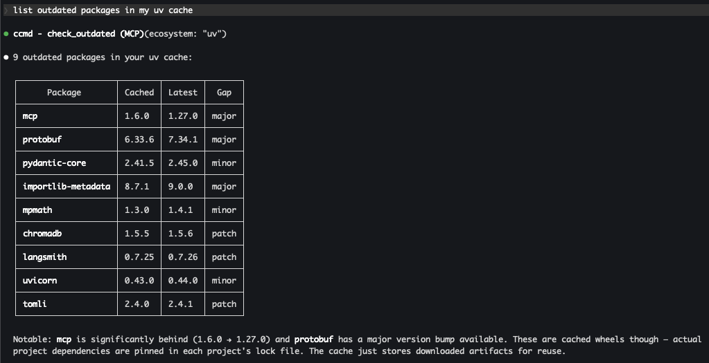
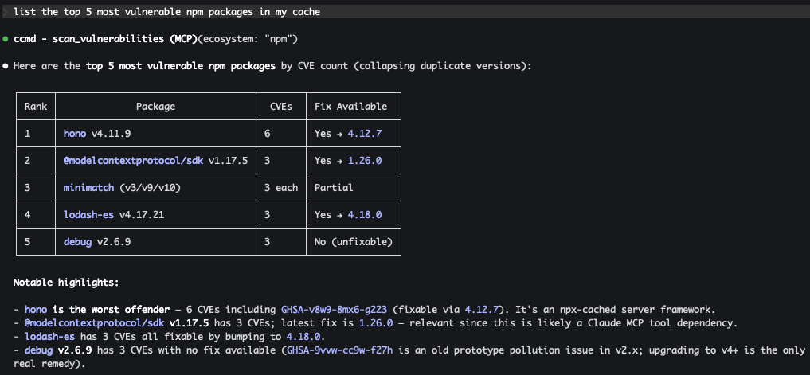

# MCP Server Guide

`ccmd` includes an [MCP](https://modelcontextprotocol.io) (Model Context Protocol) server that lets AI assistants query and manage developer caches. Through this interface, tools like Claude Code can inspect cache sizes, search for packages, check for vulnerabilities and outdated versions, and selectively delete cache entries — all without leaving the conversation.

## Building with MCP support

MCP support is an optional feature flag. It pulls in `rmcp`, `tokio`, `schemars`, and `tracing-subscriber`:

```bash
# Install from crates.io
cargo install ccmd --features mcp

# Or build from source
cargo build --release --features mcp
```

Without the `mcp` feature, `ccmd` is a pure TUI with no async runtime.

## Starting the server

```bash
ccmd mcp
```

The server communicates over stdio using the MCP protocol. It is not meant to be run directly — it's started by an AI assistant (Claude Code, Claude Desktop, etc.) via the MCP configuration.

## Configuring in Claude Code

### Global (recommended)

Register ccmd as a user-scoped MCP server so it's available in every Claude Code session:

```bash
claude mcp add ccmd -s user -- ccmd mcp
```

Verify it's connected:

```bash
claude mcp list
# ccmd: ccmd mcp - ✓ Connected
```

### Project-local

To make ccmd available only in a specific project, add a `.mcp.json` in the project root:

```json
{
  "mcpServers": {
    "ccmd": {
      "command": "ccmd",
      "args": ["mcp"]
    }
  }
}
```

Restart Claude Code to pick up the new server. The ccmd tools will then be available in your conversations.

## Examples

### List caches

> "list my caches"

```
┌──────────────────┬────────────┬───────┐
│     Provider     │    Size    │ Items │
├──────────────────┼────────────┼───────┤
│ HuggingFace Hub  │ 28.93 GiB  │ 447   │
│ ~/Library/Caches │ 11.18 GiB  │ 234   │
│ pre-commit       │ 4.05 GiB   │ 220   │
│ uv               │ 3.16 GiB   │ 149   │
│ Whisper          │ 2.88 GiB   │ 1     │
│ Homebrew         │ 1.55 GiB   │ 170   │
│ npm              │ 955.56 MiB │ 181   │
│ Cargo            │ 719.77 MiB │ 614   │
│ Chroma           │ 166.43 MiB │ 2     │
│ GitHub CLI       │ 1.77 MiB   │ 83    │
│ pip              │ 8.00 KiB   │ 63    │
└──────────────────┴────────────┴───────┘
Total: ~53.6 GiB across 2,167 items and 12 providers
```

### Find outdated packages

> "find outdated packages in my cache"



### Scan for vulnerabilities

> "find the top 5 most vulnerable npm packages in my cache"



### Clean up caches

> "delete all outdated pip caches"

Claude calls `preview_delete` first, shows you what would be removed, then calls `delete_packages` with safety enforcement.

## Available tools

| Tool | Description |
|------|-------------|
| `list_caches` | List all cache directories with size and item count per provider |
| `get_summary` | High-level dashboard of total cache usage |
| `search_packages` | Find packages by name with optional ecosystem filter |
| `get_package_details` | Full metadata for a specific cache entry (size, provider, safety level) |
| `scan_vulnerabilities` | Check cached packages for known CVEs via [OSV.dev](https://osv.dev) |
| `check_outdated` | Compare cached versions against PyPI, crates.io, and npm registries |
| `preview_delete` | Dry-run showing what would be deleted and how much space would be freed |
| `delete_packages` | Delete cache entries with safety enforcement |

### Tool parameters

Most tools accept optional filters:

- **`ecosystem`** — filter by provider: `pip`, `npm`, `cargo`, `uv`, `huggingface`, `homebrew`, etc. Aliases like `python` (→ pip), `rust` (→ cargo), `hf` (→ huggingface) are also accepted.
- **`query`** — search by package name (fuzzy match)
- **`path`** — target a specific cache entry by filesystem path

## Safety levels

`delete_packages` enforces a three-tier safety system:

| Level | Icon | Behavior | Examples |
|-------|------|----------|----------|
| **Safe** | `●` | Deleted directly | pip wheels, npm cache, Cargo crates, HuggingFace models |
| **Caution** | `◐` | Requires `confirm_caution=true` | Unknown/unrecognized cache directories |
| **Unsafe** | `○` | Rejected — use the TUI instead | Entries containing config or state |

This prevents accidental deletion of entries that may be shared, actively in use, or otherwise risky to remove through an automated interface.

## Cache roots

The MCP server scans the same default cache locations as the TUI:

- `~/.cache` (Linux and macOS)
- `~/Library/Caches` (macOS)
- `~/.npm` (if it exists)
- `~/.cargo/registry` (if it exists)

These can be overridden in `~/.config/ccmd/config.toml` — see the [user guide](user-guide.md) for configuration details.
